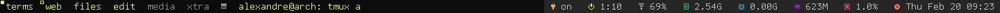

dwm status bar
==============
created:  20.02.2014
modified: 19.03.2014

This is my take on the dwm window manager status bar. 

It is probably not much portable, but you can use it as a reference for your own take on the bar. 

It makes use of the statuscolors patch for dwm and Tamsynmod font (for the cool icons). Both are dependencies
for this bar. 

Forked and rewritten from scratch from the great TrilbyWhite's Status bar: https://github.com/TrilbyWhite/dwmStatus 

(the dwm status bar makes a great project for learning a bit of the C language)

Screenshot
----------

status bar on the right:

Compiling notes
---------------

To compile this status bar (using gcc, in the source code directory):

gcc -lX11 -lm dwmbar.c -o dwmbar

Note: mofified by robcsi.
